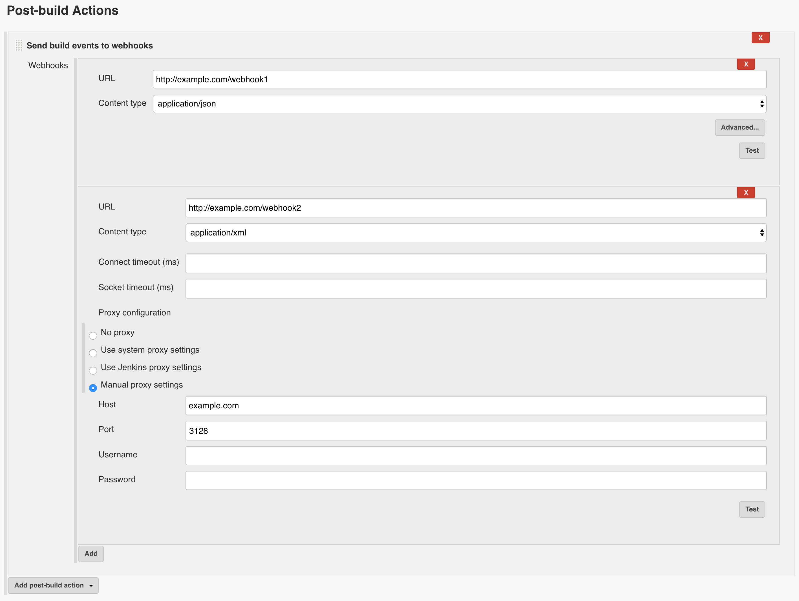

# jenkins-webhook-notifier-plugin

A Jenkins plugin to send build events to webhooks.

## Configurations

The plugin provides a post build action that sends build events to the URLs configured.

By default an event is sent in the JSON format using HTTP POST. The supported format is JSON and XML.

The timeout settings and the proxy settings for requests are available in the advanced section.

## Events

`X-Jenkins-Webhook-Event` header contains the type of the event that triggers the deliver.

### Build

An event is sent when a build starts or finishes. The value of `X-Jenkins-Webhook-Event` header is `build`.

**Payload Example**:

    {
      "actions": [
        {
          "causes": [
            {
              "shortDescription": "Started by user Admin",
              "userId": "admin",
              "userName": "Admin"
            }
          ]
        }
      ],
      "artifacts": [],
      "building": false,
      "description": null,
      "displayName": "#1",
      "duration": 7358,
      "estimatedDuration": 2655,
      "executor": {},
      "fullDisplayName": "project-001 #1",
      "id": "1",
      "keepLog": false,
      "number": 1,
      "queueId": 1,
      "result": "SUCCESS",
      "timestamp": 1533657000406,
      "url": "https://example.com/job/project-001/1/",
      "builtOn": "",
      "changeSet": {
        "items": [],
        "kind": null
      },
      "project": {
        "name": "project-001",
        "url": "https://example.com/job/project-001/",
        "color": "blue"
      }
    }

### Ping

An event is sent when "Test" button on the configuration page is clicked. The value of `X-Jenkins-Webhook-Event` header is `ping`.

**Payload Example**:

    {}

## Development

Run Jenkins (http://localhost:8080) locally with the plugin installed:

    ./gradlew server

Build the Jenkins plugin file:

    ./gradlew jpi
